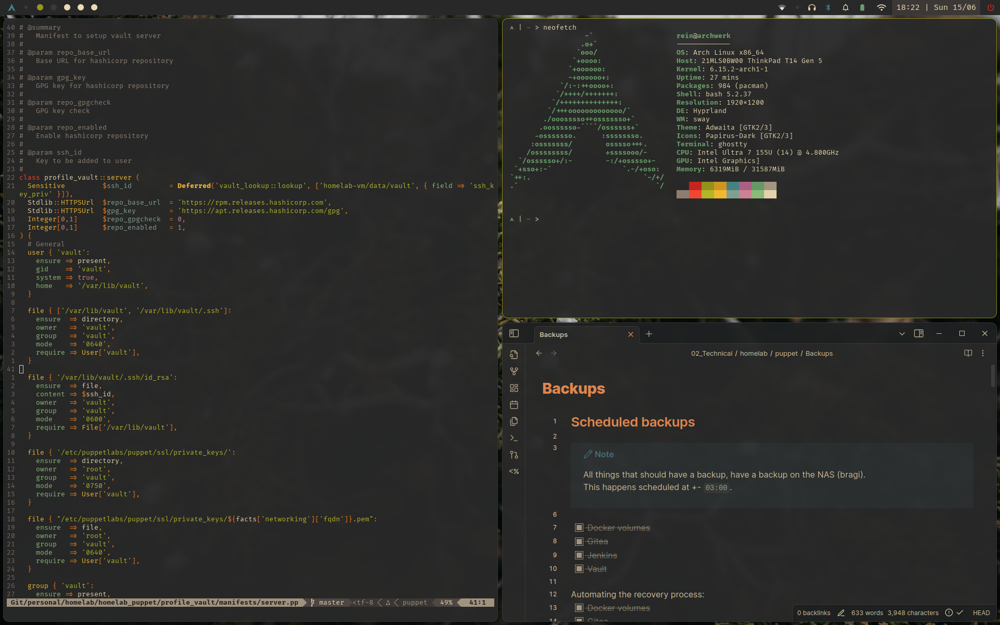

# Dotfiles
## Overview
Collection of dotfiles I currently use for my day-to-day workflow.

## Components
### Desktop & Window Manager + extra tools
| Tool | Description |
| ---- | ----------- |
| [sddm](https://github.com/sddm/sddm) | Display-management |
| [hyprland](https://github.com/hyprwm/Hyprland) | Wayland-based tiling window manager |
| [hyprlock](https://github.com/mortie/swaylock-effects) | Wayland screen locker |
| [hyprpaper](https://github.com/hyprwm/hyprpaper) | Wayland wallpaper utility |
| [hyprcursor](https://github.com/hyprwm/hyprcursor) | Hyprland cursor |
| [Waybar](https://github.com/Alexays/Waybar)| Wayland-based window bar |
| [Grim](https://sr.ht/~emersion/grim/) | Wayland screenshot utility |
| [Rofi](https://github.com/davatorium/rofi) | Menu launcher |

### Terminal + tools
| Tool | Description |
| ---- | ----------- |
| [ghostty](https://github.com/ghostty-org/ghostty) | Terminal emulator |
| [ZSH](https://github.com/zsh-users/zsh) | Shell |
| [ripgrep](https://github.com/BurntSushi/ripgrep) | grep on steroids |
| [fd](https://github.com/sharkdp/fd) | find on steroids |
| [tig](https://github.com/jonas/tig) | TUI for git |

### Font, color, theme,...
| Tool | Description |
| ---- | ----------- |
| [Firacode Nerd Font](https://github.com/ryanoasis/nerd-fonts) | JetBrains font with glyphs |
| [Gruvbox](https://github.com/Fausto-Korpsvart/Gruvbox-GTK-Theme) | GTK theme |
| [Papirus](https://github.com/PapirusDevelopmentTeam/papirus-icon-theme) | Icons |
